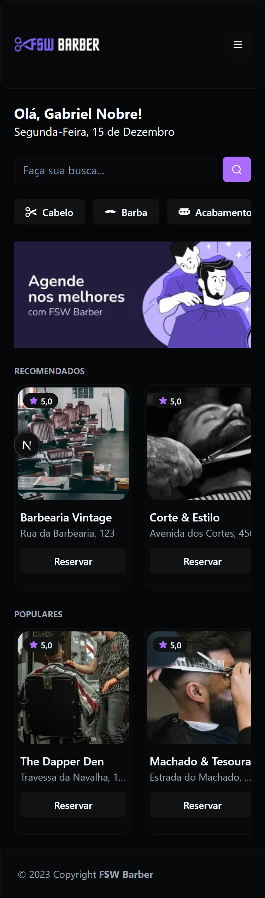
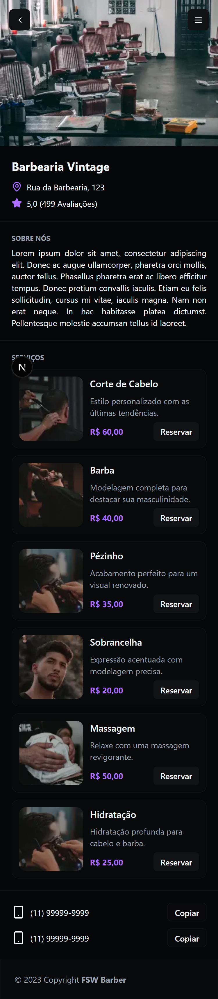

# FSW Barber

Uma aplicação de agendamento para barbearias construída com Next.js e TypeScript. Este repositório contém a interface, autenticação e integração com banco de dados via Prisma.

### Descrição

- Projeto criado para gerenciar barbearias, serviços e agendamentos de clientes.
- Permite que clientes visualizem barbearias, escolham serviços, selecionem horários e confirmem reservas.

### Principais Tecnologias

- **Next.js** (React) - renderização híbrida e rotas.
- **TypeScript** - tipagem estática.
- **Prisma** - ORM para acesso ao banco de dados.
- **NextAuth** - autenticação e sessões.
- **Tailwind CSS** - estilização (configurada via PostCSS).
- **React Hook Form** + **Zod** - formulários e validação.

### Funcionalidades existentes

- Listagem de barbearias e detalhe por barbearia.
- Visualização e seleção de serviços.
- Fluxo de criação e exclusão de reservas (bookings).
- Autenticação via `next-auth`.
- Dashboard/itens de UI reutilizáveis (componentes em `src/app/_components`).

### Como executar (desenvolvimento)

Pré-requisitos:

- Node.js 18+ instalado
- Um banco de dados (ex.: PostgreSQL, SQLite). Configure `DATABASE_URL`.

Passos:

1. Instalar dependências:

```bash
npm install
```

2. Gerar cliente Prisma (opcionalmente via `prepare`):

```bash
npx prisma generate
# ou
npm run prepare
```

3. Aplicar migrações e criar o banco de dados:

```bash
npx prisma migrate dev
```

4. Rodar seed (se desejar popular dados iniciais):

```bash
npx prisma db seed
```

5. Rodar em modo desenvolvimento:

```bash
npm run dev
```

Build e produção:

```bash
npm run build
npm start
```

Variáveis de ambiente recomendadas:

- `DATABASE_URL` — string de conexão do banco
- `NEXTAUTH_SECRET` — segredo para next-auth
- `NEXTAUTH_URL` — URL base da aplicação (ex.: http://localhost:3000)

### Estrutura principal do projeto

- `src/app/` — rotas e páginas do Next.js
- `src/app/_components/` — componentes reutilizáveis e UI
- `src/app/_lib/` — utilitários, Prisma e autenticação
- `prisma/` — esquema Prisma, migrations e seed

### Screenshots




### Contribuição

- Contribuições são bem-vindas!

### 👽Contato

gabriel_nobresantos@hotmail.com
